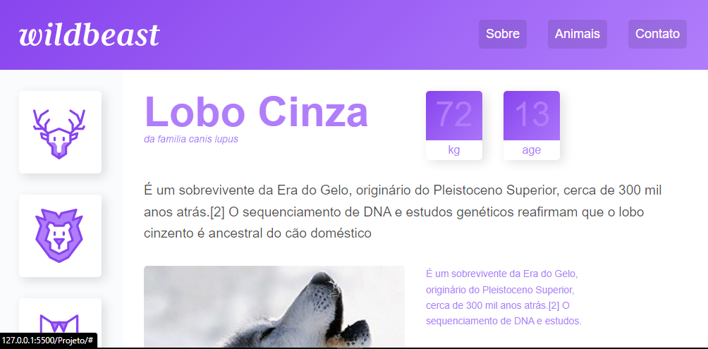
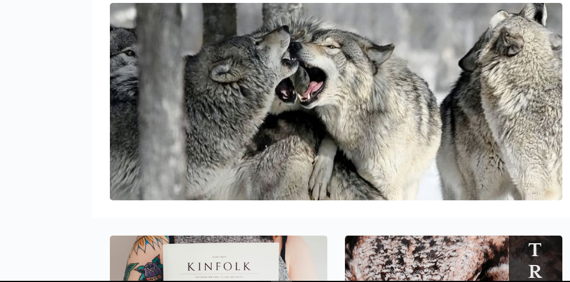

# Layout Widbeast

Este `layout` foi desenvolvido para fins de exercícios em `css`. O `site` apresenta uma família de `animais` especificamente o `Lobo Cinza` praticamente um breve historial sobre os `lobos`.

## Tecnologias

As seguintes ferramentas foram usadas para constuição deste projeto:

- HTML
- CSS

#

Feito por ❤ Pascoal Kahamba meu [Linkedin](https://www.linkedin.com/in/pascoal-kahamba-7b43bb233?lipi=urn%3Ali%3Apage%3Ad_flagship3_profile_view_base_contact_details%3BTg8LEKayToyytOX1pVAQ%2Bg%3D%3D)

[👉Clique aqui se deseja ver a aplicação rodando!👈😎](https://conta-diasdo-ano.vercel.app/)
